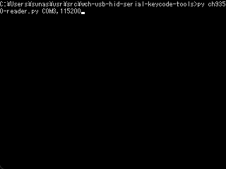
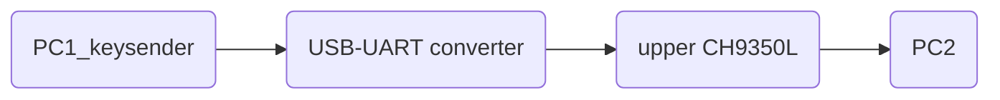
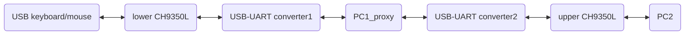
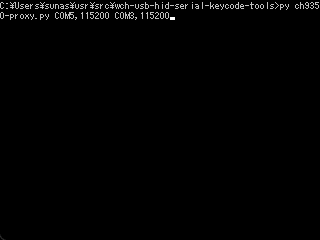
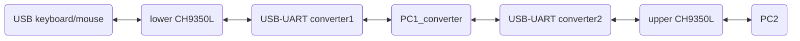
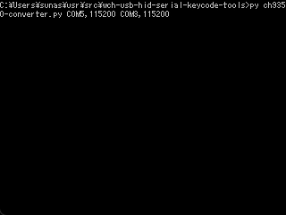

# wch-usb-hid-serial-keycode-tools
WCH社の「USB HID over UART」チップ向けのツールおよびPythonライブラリです:
- **CH9350L** — 双方向のUSBキーボード/マウス-UARTブリッジ。HIDレポートフレームの読み・書き・変換を行います。([データシート](http://www.wch-ic.com/downloads/CH9350DS_PDF.html))
- **CH9329** — UARTコマンドパケットからUSBキーボード/マウスをエミュレートするシリアル-USB HIDチップ。([データシート](https://www.wch.cn/uploads/file/20190508/1557278355473027.pdf))
- **CH9328** — よりシンプルなUART-USB HID **キーボード**チップ（マウス無し）。生の8バイトHIDレポート、またはASCIIテキストを送ります。([データシート](https://wch-ic.com/downloads/CH9328DS1_PDF.html))

[CH9350L 用ツール](#ツール)、[CH9329](#ch9329)、[CH9328](#ch9328) 節を参照してください。  
本ツールはWCH社の公式ツールではありません。

[English](https://github.com/sunasaji/wch-usb-hid-serial-keycode-tools/blob/master/README.md) | Japanese

# 実行環境
- Windows11 10.0.25126
- Python 3.11 以降（Windowsの場合）
- pyserial 3.5

Windowsでは Python 3.11 以降を使用してください。`ch9350-keysender` は
CH9350Lが文字を取りこぼさないよう、HIDレポートの間に短い遅延（`time.sleep()`）
を入れています。Windowsの `time.sleep()` の分解能は Python 3.10 以前では
OSのタイマ刻み（約15.6ms）に律速されるため、この短い遅延が必要以上に長くなり
転送が遅くなります。Python 3.11 以降は高分解能の待機可能タイマを使うため、
意図したとおりの遅延になります。（Linux/macOS では Python 3.10 でも問題ありません。）

# インストール
```
pip install wch-hid-serial
```
これにより `ch9350-reader`、`ch9350-proxy`、`ch9350-converter`、
`ch9350-keysender`、`ch9329-keysender`、`ch9329-mouse`、`ch9328-keysender`
コマンドがインストールされます。本リポジトリのチェックアウトからインストール
する場合は `pip install .`（開発用には `pip install -e .`）を実行してください。

# ライブラリとしての利用
各ツールは `wch_hid_serial` パッケージの薄いラッパであり、自作のコードからも
利用できます。以下の各例は、コードとその出力を併記しています。

**キーボードレポートの変換** — `convert_report()` はCH9350Lのキーボードレポート
のペイロードを変換表で書き換え、再計算したチェックサムを付けて返します。
```python
from wch_hid_serial.ch9350 import convert_report

# 既定の変換表: Caps Lock (0x39) -> Left Ctrl (0xe0)
payload = bytes.fromhex("01 00 00 39 00 00 00 00 00 5f")
print(convert_report(payload).hex(" "))
# 01 01 00 00 00 00 00 00 00 5f 61

# カスタム変換表: 'a' キー (0x04) を Left Shift (0xe1) に変換
payload = bytes.fromhex("01 00 00 04 00 00 00 00 00 20")
print(convert_report(payload, {0x04: 0xe1}).hex(" "))
# 01 02 00 00 00 00 00 00 00 20 23
```

**テキストからキーレポートを生成** — `iter_key_reports()` は `(frame, is_char)`
のペアを返します。同じキーが連続する場合、それぞれ別の打鍵として認識されるよう
間に空レポートが挿入されます。
```python
from wch_hid_serial.ch9350 import iter_key_reports

for frame, is_char in iter_key_reports("Hi!"):
    print(frame.hex(" "))
# 57 ab 01 02 00 0b 00 00 00 00 00   (H, Shiftあり)
# 57 ab 01 00 00 0c 00 00 00 00 00   (i)
# 57 ab 01 02 00 1e 00 00 00 00 00   (!, Shiftあり)

for frame, is_char in iter_key_reports("aa"):
    print(frame.hex(" "))
# 57 ab 01 00 00 04 00 00 00 00 00   (a)
# 57 ab 01 00 00 00 00 00 00 00 00   (空レポート、連続打鍵の間に挿入)
# 57 ab 01 00 00 04 00 00 00 00 00   (a)
```

**HIDキーコードの参照** — `ascii_to_keycode()` は `(shift, keycode)` を返します。
```python
from wch_hid_serial.hid import ascii_to_keycode

print(ascii_to_keycode("A"))     # (True, 4)   Shift + キーコード 0x04
print(ascii_to_keycode("a"))     # (False, 4)
print(ascii_to_keycode("\x00"))  # None        (キーコードなし)
```

**デバイスからフレームを読む** — `iter_lower_frames()` はCH9350Lの下位機を読み、
生のフレームを返します。シリアルポートが必要なため、出力は環境に依存します。
```python
from wch_hid_serial.ch9350 import iter_lower_frames, open_port

for frame in iter_lower_frames(open_port("COM1,115200")):
    print(frame.hex(" "))
# 57 ab 83 0c 12 01 00 00 39 00 00 00 00 00 5f 99   (Caps Lock 押下)
# 57 ab 83 0c 12 01 00 00 8b 00 00 00 00 00 65 f1   (無変換 押下)
```

# ツール

## ch9350-reader.py
CH9350Lのシリアルデータを読んで、それぞれのコマンドを出力します。

**構成図:**

```mermaid
flowchart LR
usbkm(USB keyboard/mouse)
ch9350l(lower CH9350L)
usb-uart(USB-UART converter)
pc1(PC1_reader)
usbkm --> ch9350l
ch9350l --> usb-uart
usb-uart --> pc1
```

**使用法:** ```ch9350-reader <portname>,<baudrate>```  
**コマンド例:** ```ch9350-reader COM1,115200```  
**出力例**:  


## ch9350-keysender.py
本スクリプトは標準入力よりテキストの入力を受け取り、各文字のキーコードをCH9350Lの上位機に送信します。  
私の環境では、CH9350Lのボーレートを115200bps、`--wait-ms 8` と設定しています。  
送信用バイナリファイルをBase64でエンコードしたところ13.3KBの文字列となりました。このテキストデータを標準入力に貼り付けました。  
送信には120秒かかり、エラーはありませんでした。  
データ転送速度は 6.6KB/分 = 111B/秒 = 889bps となりました。  
CH9350Lの37,38番ピンをGNDに接続し、ボーレートを300,000bpsに設定し、`--wait-ms` を少し小さく設定することにより、より高速な転送ができるかもしれません。  
送信データは改行で終わる必要があります。改行を付けない場合、最後の文字が無限に入力され続けてしまいます。  
**構成図:**

```mermaid
flowchart LR
pc1(PC1_keysender)
usb-uart(USB-UART converter)
ch9350l(upper CH9350L)
pc2(PC2)
pc1 --> usb-uart
usb-uart --> ch9350l
ch9350l --> pc2
```

**使用法:** ```ch9350-keysender [--wait-ms <ミリ秒>] <portname>,<baudrate>```  
**コマンド例:** ```ch9350-keysender COM1,115200```  
`--wait-ms` はHIDレポート間の遅延（ミリ秒）を指定します（既定 8）。  
**送信例:**  


本スクリプトの ASCII_TO_KEYCODE 表は、下記のソースコードから引用しています。  
https://github.com/adafruit/Adafruit_CircuitPython_HID/blob/main/adafruit_hid/keyboard_layout_us.py

## ch9350-proxy.py
本スクリプトはCH9350Lの下位機のシリアルデータを読み取り、同じデータを上位機に送ります。  
**構成図:**

```mermaid
flowchart LR
usbkm(USB keyboard/mouse)
ch9350l_L(lower CH9350L)
usb-uart_L(USB-UART converter1)
pc1(PC1_proxy)
usb-uart_U(USB-UART converter2)
ch9350l_U(upper CH9350L)
pc2(PC2)
usbkm <--> ch9350l_L
ch9350l_L <--> usb-uart_L
usb-uart_L <--> pc1
pc1 <--> usb-uart_U
usb-uart_U <--> ch9350l_U
ch9350l_U <--> pc2
```

**使用法:** ```ch9350-proxy <upper_portname>,<upper_baudrate> <lower_portname>,<lower_baudrate>```  
**コマンド例:** ```ch9350-proxy COM1,115200 COM2,115200```  
**通信例:** (2個のCH9350L間)  
  
凡例:  
`L>` CH9350Lの下位機からPC1に送られたデータ  
`L<` CH9350Lの下位機にPC1から送られたデータ  
`U>` CH9350Lの上位機からPC1に送られたデータ  
`U<` CH9350Lの上位機にPC1から送られたデータ

## ch9350-converter.py
本スクリプトはCH9350Lの下位機のシリアルデータを読み、 **キー変換表に従って一部のキーコードを変換し、** 変換されたデータを上位のCH9350Lに送信します。  
**構成図:**

```mermaid
flowchart LR
usbkm(USB keyboard/mouse)
ch9350l_L(lower CH9350L)
usb-uart_L(USB-UART converter1)
pc1(PC1_converter)
usb-uart_U(USB-UART converter2)
ch9350l_U(upper CH9350L)
pc2(PC2)
usbkm <--> ch9350l_L
ch9350l_L <--> usb-uart_L
usb-uart_L <--> pc1
pc1 <--> usb-uart_U
usb-uart_U <--> ch9350l_U
ch9350l_U <--> pc2
```

**使用法:** ```ch9350-converter <upper_portname>,<upper_baudrate> <lower_portname>,<lower_baudrate>```  
**コマンド例:** ```ch9350-converter COM1,115200 COM2,115200```  
**既定のキー変換表** (`wch_hid_serial/ch9350/convert.py` の `DEFAULT_TABLE`):

| 入力キーコード | 出力キーコード |
| --- | --- |
| 0x39 (Caps Lock) | 0xe0 (Left Ctrl) |
| 0x8a (変換) | 0xe0 (Left Ctrl) |
| 0x8b (無変換) | 0xe2 (Left Alt) |

```
モディファイヤキーはキー変換表では下記のコードで表現されます。
e0: Left Control
e1: Left Shift
e2: Left Alt
e3: Left GUI
e4: Right Control
e5: Right Shift
e6: Right Alt
e7: Right GUI
```
その他のキーコードはこちらで一覧が見られます。 [MightyPork/usb_hid_keys.h](https://gist.github.com/MightyPork/6da26e382a7ad91b5496ee55fdc73db2)

**通信例:** (2個のCH9350L間)  
  
この例では、  
```
L> 57 ab 83 0c 12 01 00 00 39 00 00 00 00 00 5f 99 (00 00 39:Caps Lock) は下記に変換されます。
U< 57 ab 83 0c 12 01 01 00 00 00 00 00 00 00 5f 61 (01 00 00:Control)
```
```
L> 57 ab 83 0c 12 01 00 00 8b 00 00 00 00 00 65 f1 (00 00 8b:Muhenkan) は下記に変換されます。
U< 57 ab 83 0c 12 01 04 00 00 00 00 00 00 00 65 6a (04 00 00:Alt)
```
```
L> 57 ab 83 0c 12 01 00 00 8a 00 00 00 00 00 6b f6 (00 00 8a:Henkan) は下記に変換されます。
U< 57 ab 83 0c 12 01 01 00 00 00 00 00 00 00 6b 6d (01 00 00:Control)
```

# CH9329
本パッケージは **CH9329** にも対応しています。CH9329 はWCHの別のチップで、
UARTコマンドパケットを受け取って USB HID キーボード/マウスを *エミュレート*
します。これは CH9350L の **upper（上位）** 側と同じ役割です。どちらもシリアル
入力から USB HID デバイスをエミュレートし、単体でも使えます（`ch9350-keysender`
は CH9350L の upper を単体で駆動する例です）。違いはインターフェースの抽象度で、
CH9329 は高レベルなコマンドプロトコル、CH9350L はほぼ生の HIDレポートフレームを
流します。CH9329 のパケットは `57 AB <addr> <cmd> <len> <data...> <sum>` の
形式です。

**テキストをUSB打鍵として送信** — `ch9329-keysender` コマンド:  
**使用法:** ```ch9329-keysender [--wait-ms <ミリ秒>] <portname>,<baudrate>```  
**コマンド例:** ```ch9329-keysender COM1,9600```  
標準入力のテキストを読み、CH9329経由で打鍵します（1文字につき押下と解放の
レポートを送信）。CH9329 の既定ボーレートは 9600 です。

**マウス操作** — `ch9329-mouse` コマンド（1回につき1操作を引数で実行）:  
**使用法:** ```ch9329-mouse <portname>,<baudrate> <操作> ...```  
```
ch9329-mouse COM1,9600 move 100 200 --screen 1920x1080  # 絶対（画面ピクセル）
ch9329-mouse COM1,9600 move 5 -3 --relative             # 相対移動
ch9329-mouse COM1,9600 click --button right             # クリック
ch9329-mouse COM1,9600 down --button left               # 押下保持
ch9329-mouse COM1,9600 up --button left                 # 解放
ch9329-mouse COM1,9600 scroll -2                         # 下スクロール
ch9329-mouse COM1,9600 drag 100 100 300 300 --screen 1920x1080
```

**ライブラリとしての利用:**
```python
from wch_hid_serial.ch9329 import Ch9329, open_port
from wch_hid_serial.hid import modifier_name_to_bit

dev = Ch9329(open_port("COM1,9600"))
dev.type_text("Hello!\n")                        # USBキーボードとして打鍵
dev.tap_key(0x04, modifier_name_to_bit("ctrl"))  # Ctrl+A（押下＋解放）
dev.click("left")                                # クリック
dev.move_absolute(960, 540, screen=(1920, 1080)) # 画面中央へ移動
dev.drag(100, 100, 300, 300, screen=(1920, 1080))# ドラッグ（移動中ボタン保持）
```

パケットビルダは純粋（ポート不要）なのでテストが容易です:
```python
from wch_hid_serial.ch9329 import general_packet, relative_packet

print(general_packet(0, [0x04]).hex(" "))  # 'a' キー
# 57 ab 00 02 08 00 00 04 00 00 00 00 00 10
print(relative_packet(5, -3).hex(" "))
# 57 ab 00 05 05 01 00 05 fd 00 0f
```
実行可能なサンプルは [examples/ch9329_demo.py](examples/ch9329_demo.py) を参照してください。

# CH9328
**CH9328** はよりシンプルなWCHチップで、UART-USB HID **キーボード**専用（マウス
無し）、コマンド枠やチェックサムもありません。動作モードは**ハードウェアのピン**で
選択します:
- **Mode 0–2:** ASCIIテキストをそのまま送ると、チップ側で打鍵に変換します。
- **Mode 3:** 生の8バイトHIDキーボードレポート（`[modifier, 0x00, key1..key6]`）を送ります。

**テキストの送信** — `ch9328-keysender` コマンド（`--mode` をチップのピン設定に合わせます）:  
**使用法:** ```ch9328-keysender [--mode hid|ascii] [--wait-ms <ミリ秒>] <portname>,<baudrate>```  
```
ch9328-keysender COM1,9600               # Mode 3: 生HIDレポート（既定）
ch9328-keysender --mode ascii COM1,9600  # Mode 0–2: テキストをそのまま送信
```

**ライブラリとしての利用:**
```python
from wch_hid_serial.ch9328 import Ch9328, open_port, keyboard_report

dev = Ch9328(open_port("COM1,9600"))
dev.type_text("Hello!\n")     # Mode 3: 生HIDレポート（1文字ごとに押下＋解放）
dev.send_ascii("Hello!\n")    # Mode 0–2: チップがASCIIを打鍵に変換

print(keyboard_report(0, [0x04]).hex(" "))  # 'a' キーの生8バイトレポート
# 00 00 04 00 00 00 00 00
```
データシート: <https://wch-ic.com/downloads/CH9328DS1_PDF.html>。実行可能な
サンプルは [examples/ch9328_demo.py](examples/ch9328_demo.py) を参照してください。

# キー名とレイアウト
共有の `wch_hid_serial.hid` 層は、キー名や文字を HID キーコードに解決し、
差し替え可能なキーボードレイアウトに対応します。どのチップのキーボードレポートを
組み立てる際にも便利です。
```python
from wch_hid_serial.hid import (
    resolve_key, char_to_hid, special_key_to_hid, set_layout, validate_chars,
    keyboard_report,
)

resolve_key("c", ["ctrl"])    # (0x01, 0x06)  Ctrl+C の (modifier, keycode)
special_key_to_hid("f5")      # 0x3e
char_to_hid("@")              # (0x02, 0x1f)  US では Shift+2

# キー組み合わせの8バイトHIDレポートを組み立てる:
mod, kc = resolve_key("a", ["ctrl"])
keyboard_report(mod, [kc])    # b'\x01\x00\x04\x00\x00\x00\x00\x00'

# レイアウト切替（組み込み: us104, jp106, uk105, de105, fr105）:
set_layout("jp106")
char_to_hid("@")              # (0x00, 0x2f)  JIS では '@' は非シフト

validate_chars("Hello!\n")    # 打鍵できない文字があれば ValueError
```
組み込みレイアウトは個別の YAML ファイルです。**Pythonを一切触らず**に自作の
レイアウトを追加できます: `<name>.yaml` をディレクトリに置き、環境変数
`WCH_HID_LAYOUTS_DIR` で指すか、`set_layout` に `layouts_dir=` を渡します
（例: `set_layout("myiso", layouts_dir="/path/to/layouts")`）。メモリ上に登録する
`register_layout(name, overrides)` や、1ファイルを読む `load_layout_yaml(path)`
も使えます。ファイル形式と HID キーコード表は
[レイアウトガイド](src/wch_hid_serial/hid/layouts/README.md) を参照してください。

# Tips
CygwinやMSYSのterminalを使う場合、[winpty](https://github.com/rprichard/winpty) コマンドをこのように使ってください。 ```winpty ch9350-reader COM1,115200```

# License

## [wch-usb-hid-serial-keycode-tools](https://github.com/sunasaji/wch-usb-hid-serial-keycode-tools)
Copyright (c) 2022 Suna.S  
Released under the MIT License  
https://github.com/sunasaji/wch-usb-hid-serial-keycode-tools/blob/master/LICENSE.txt

## [Adafruit_CircuitPython_HID](https://github.com/adafruit/Adafruit_CircuitPython_HID)
Copyright (c) 2017 Scott Shawcroft for Adafruit Industries  
Released under the MIT License  
https://github.com/adafruit/Adafruit_CircuitPython_HID/blob/main/LICENSE
