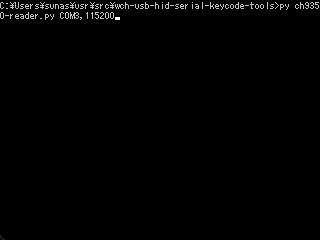
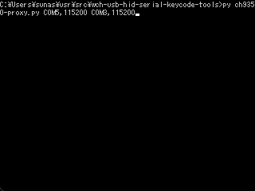
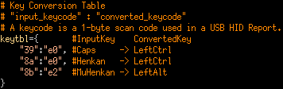
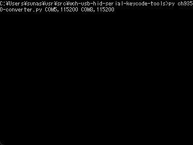

# wch-usb-hid-serial-keycode-tools
WCH社のUSBキーボード・マウス-UART コミュニケーションコントロールチップ、CH9350Lのシリアルデータを読み・書き・変換するツールです。  
本ツールはWCH社の公式ツールではありません。  
CH9350Lのデータシートはこちらから参照できます。 http://www.wch-ic.com/downloads/CH9350DS_PDF.html

[English](https://github.com/sunasaji/wch-usb-hid-serial-keycode-tools/blob/master/README.md) | Japanese

# 実行環境
- Windows11 10.0.25126
- Python 3.10.4
- pyserial 3.5

# ツール

## ch9350-reader.py
CH9350Lのシリアルデータを読んで、それぞれのコマンドを出力します。

**構成図:**


**使用法:** ```ch9350-reader.py <portname>,<baudrate>```  
**Windowsでのコマンド例:** ```> py ch9350-reader.py COM1,115200```  
**出力例**:  


## ch9350-keysender.py
本スクリプトは標準入力よりテキストの入力を受け取り、各文字のキーコードをCH9350Lの上位機に送信します。  
私の試行時には、CH9350Lの37,38番ピンをGNDに接続し、ボーレートを300,000bpsに設定しました。  
そして送信用データをZip圧縮してBase64エンコードし、生成された70KBのテキストデータを標準入力に貼り付けました。  
送信には14分掛かったので、データ転送速度は 5KB/分 = 83B/秒 = 664bps となりました。  
送信データは改行で終わる必要があります。改行を付けない場合、最後の文字が無限に入力され続けてしまいます。  
**構成図:**


**使用法:** ```ch9350-keysender.py <portname>,<baudrate>```  
**Windowsでのコマンド例:** ```> py ch9350-keysender.py COM1,115200```  

本スクリプトの ASCII_TO_KEYCODE 表は、下記のソースコードから引用しています。  
https://github.com/adafruit/Adafruit_CircuitPython_HID/blob/main/adafruit_hid/keyboard_layout_us.py

## ch9350-proxy.py
本スクリプトはCH9350Lの下位機のシリアルデータを読み取り、同じデータを上位機に送ります。  
**構成図:**


**使用法:** ```ch9350-proxy.py <upper_portname>,<upper_baudrate> <lower_portname>,<lower_baudrate>```  
**Windowsでのコマンド例:** ```> py ch9350-proxy.py COM1,115200 COM2,115200```  
**通信例:** (2個のCH9350L間)  
  
凡例:  
`L>` CH9350Lの下位機からPC1に送られたデータ  
`L<` CH9350Lの下位機にPC1から送られたデータ  
`U>` CH9350Lの上位機からPC1に送られたデータ  
`U<` CH9350Lの上位機にPC1から送られたデータ

## ch9350-converter.py
本スクリプトはCH9350Lの下位機のシリアルデータを読み、 **キー変換表に従って一部のキーコードを変換し、** 変換されたデータを上位のCH9350Lに送信します。  
**構成図:**


**使用法:** ```ch9350-converter.py <upper_portname>,<lower_baudrate> <lower_portname>,<lower_baudrate>```  
**Windowsでのコマンド例:** ```> py ch9350-converter.py COM1,115200 COM2,115200```  
**キー変換表の例:**  
  
```
モディファイヤキーはキー変換表では下記のコードで表現されます。
e0: Left Control
e1: Left Shift
e2: Left Alt
e3: Left GUI
e4: Right Control
e5: Right Shift
e6: Right Alt
e7: Right GUI
```
その他のキーコードはこちらで一覧が見られます。 [MightyPork/usb_hid_keys.h](https://gist.github.com/MightyPork/6da26e382a7ad91b5496ee55fdc73db2)

**通信例:** (2個のCH9350L間)  
  
この例では、  
```
L> 57 ab 83 0c 12 01 00 00 39 00 00 00 00 00 5f 99 (00 00 39:Caps Lock) は下記に変換されます。
U< 57 ab 83 0c 12 01 01 00 00 00 00 00 00 00 5f 61 (01 00 00:Control)
```
```
L> 57 ab 83 0c 12 01 00 00 8b 00 00 00 00 00 65 f1 (00 00 8b:Muhenkan) は下記に変換されます。
U< 57 ab 83 0c 12 01 04 00 00 00 00 00 00 00 65 6a (04 00 00:Alt)
```
```
L> 57 ab 83 0c 12 01 00 00 8a 00 00 00 00 00 6b f6 (00 00 8a:Henkan) は下記に変換されます。
U< 57 ab 83 0c 12 01 01 00 00 00 00 00 00 00 6b 6d (01 00 00:Control)
```

# Tips
CygwinやMSYSのterminalを使う場合、[winpty](https://github.com/rprichard/winpty) コマンドをこのように使ってください。 ```winpty py ch9350-reader.py COM1,115200```

# License

## [wch-usb-hid-serial-keycode-tools](https://github.com/sunasaji/wch-usb-hid-serial-keycode-tools)
Copyright (c) 2022 Suna.S  
Released under the MIT License  
https://github.com/sunasaji/wch-usb-hid-serial-keycode-tools/blob/master/LICENSE.txt

## [Adafruit_CircuitPython_HID](https://github.com/adafruit/Adafruit_CircuitPython_HID)
Copyright (c) 2017 Scott Shawcroft for Adafruit Industries  
Released under the MIT License  
https://github.com/adafruit/Adafruit_CircuitPython_HID/blob/main/LICENSE
