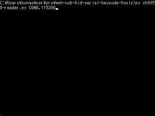
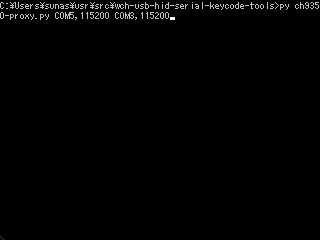
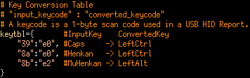
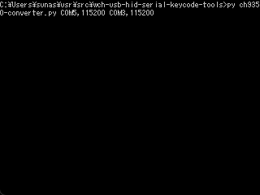

# wch-usb-hid-serial-keycode-tools
A tool to read/write/convert serial data of CH9350L: USB Keyboard and Mouse to UART Communication Control Chip by WCH.  
This software is not an official product of WCH company.  
CH9350L Datasheet is here: http://www.wch-ic.com/downloads/CH9350DS_PDF.html

English | [Japanese](https://github.com/sunasaji/wch-usb-hid-serial-keycode-tools/blob/master/README-ja.md)

# Environment
- Windows11 10.0.25126
- Python 3.10.4
- pyserial 3.5

# Tools

## ch9350-reader.py
This script reads serial data from lower CH9350L and prints each command.  
**Structure chart:**


**Usage:** ```ch9350-reader.py <portname>,<baudrate>```  
**Example command for Windows:** ```> py ch9350-reader.py COM1,115200```  
**Example output**:  


## ch9350-keysender.py
This script reads text input from standard input and sends keycode to upper CH9350L.  
I set CH9350L serial speed to 300,000 bps by connecting PIN37 and 38 to GND.  
Then I pasted zipped and Base64-encoded 70KB data to the standard input of this script.  
It needs 14min to transport, so the data transfer speed is 5KB/min = 83B/s = 664bps in my environment.  
Send data should end with a new line. Otherwise, the last character repeats endlessly.  
**Structure chart:**


**Usage:** ```ch9350-keysender.py <portname>,<baudrate>```  
**Example command for Windows:** ```> py ch9350-keysender.py COM1,115200```  
**Example input:**  


ASCII_TO_KEYCODE table in this script is derived from below code:  
https://github.com/adafruit/Adafruit_CircuitPython_HID/blob/main/adafruit_hid/keyboard_layout_us.py

## ch9350-proxy.py
This script reads serial data from lower CH9350L and sends the same data to upper CH9350L.  
**Structure chart:**


**Usage:** ```ch9350-proxy.py <upper_portname>,<upper_baudrate> <lower_portname>,<lower_baudrate>```  
**Example command for Windows:** ```> py ch9350-proxy.py COM1,115200 COM2,115200```  
**Example communication:** (between two CH9350L chips)  
  
Explanatory notes:  
`L>` indicates data sent from lower CH9350L to PC1  
`L<` indicates data sent to lower CH9350L from PC1  
`U>` indicates data sent from upper CH9350L to PC1  
`U<` indicates data sent to upper CH9350L from PC1  

## ch9350-converter.py
This script reads serial data from lower CH9350L, **converts some key codes by conversion table,** and sends the converted data to upper CH9350L.  
**Structure chart:**


**Usage:** ```ch9350-converter.py <upper_portname>,<lower_baudrate> <lower_portname>,<lower_baudrate>```  
**Example command for Windows:** ```> py ch9350-converter.py COM1,115200 COM2,115200```  
**Example key conversion table:**  
  
```
Modifier keys are expressed by codes below in key conversion table:
e0: Left Control
e1: Left Shift
e2: Left Alt
e3: Left GUI
e4: Right Control
e5: Right Shift
e6: Right Alt
e7: Right GUI
```
Other keycodes are listed here: [MightyPork/usb_hid_keys.h](https://gist.github.com/MightyPork/6da26e382a7ad91b5496ee55fdc73db2)

**Example conversion:** (between two CH9350L chips)  
  
In this case,  
```
L> 57 ab 83 0c 12 01 00 00 39 00 00 00 00 00 5f 99 (00 00 39:Caps Lock) is converted to
U< 57 ab 83 0c 12 01 01 00 00 00 00 00 00 00 5f 61 (01 00 00:Control)
```
```
L> 57 ab 83 0c 12 01 00 00 8b 00 00 00 00 00 65 f1 (00 00 8b:Muhenkan) is converted to
U< 57 ab 83 0c 12 01 04 00 00 00 00 00 00 00 65 6a (04 00 00:Alt)
```
```
L> 57 ab 83 0c 12 01 00 00 8a 00 00 00 00 00 6b f6 (00 00 8a:Henkan) is converted to
U< 57 ab 83 0c 12 01 01 00 00 00 00 00 00 00 6b 6d (01 00 00:Control)
```

# Tips
On Cygwin or MSYS terminal, use [winpty](https://github.com/rprichard/winpty) like this: ```winpty py ch9350-reader.py COM1,115200```

# License

## [wch-usb-hid-serial-keycode-tools](https://github.com/sunasaji/wch-usb-hid-serial-keycode-tools)
Copyright (c) 2022 Suna.S  
Released under the MIT License  
https://github.com/sunasaji/wch-usb-hid-serial-keycode-tools/blob/master/LICENSE.txt

## [Adafruit_CircuitPython_HID](https://github.com/adafruit/Adafruit_CircuitPython_HID)
Copyright (c) 2017 Scott Shawcroft for Adafruit Industries  
Released under the MIT License  
https://github.com/adafruit/Adafruit_CircuitPython_HID/blob/main/LICENSE
